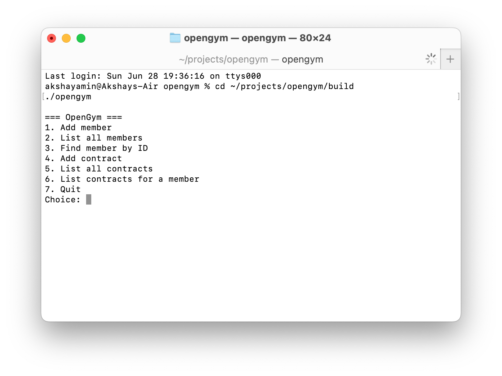
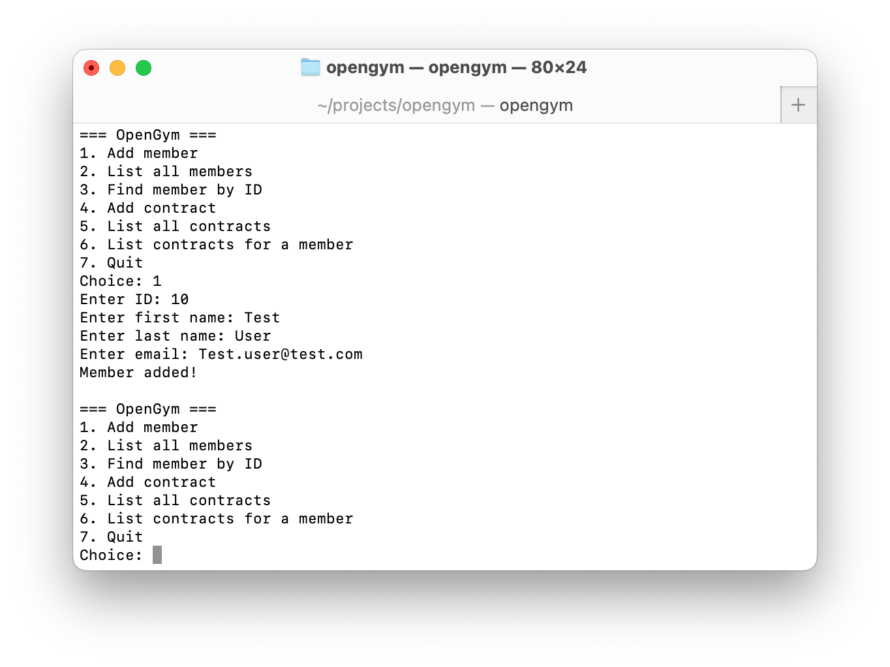
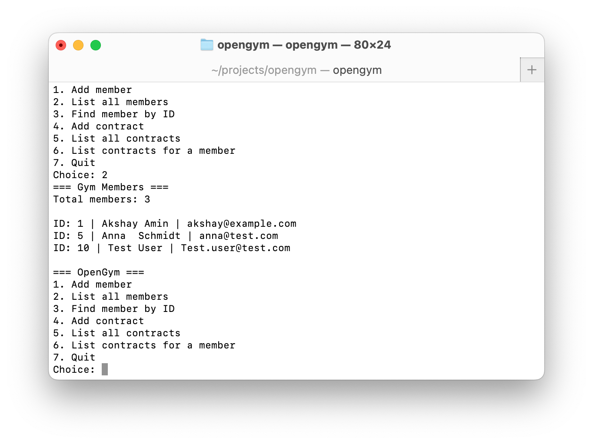
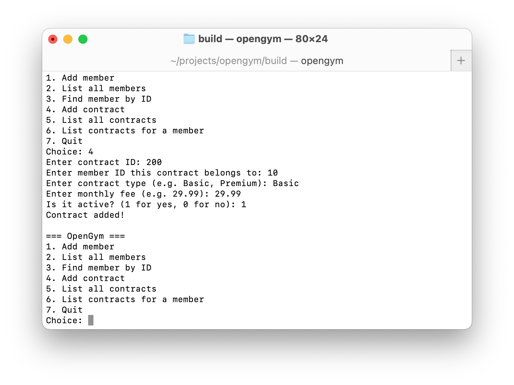
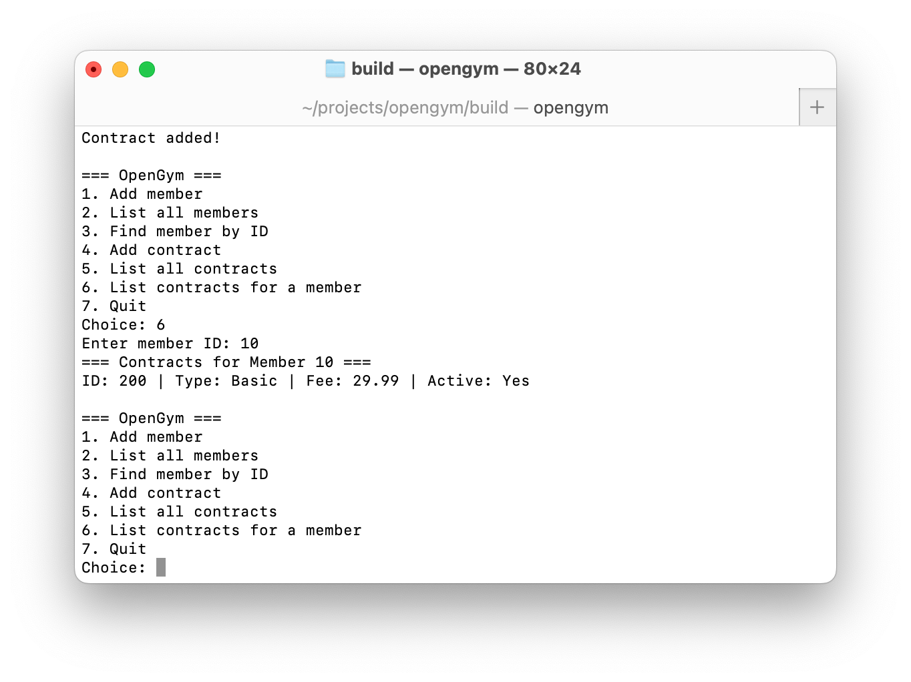
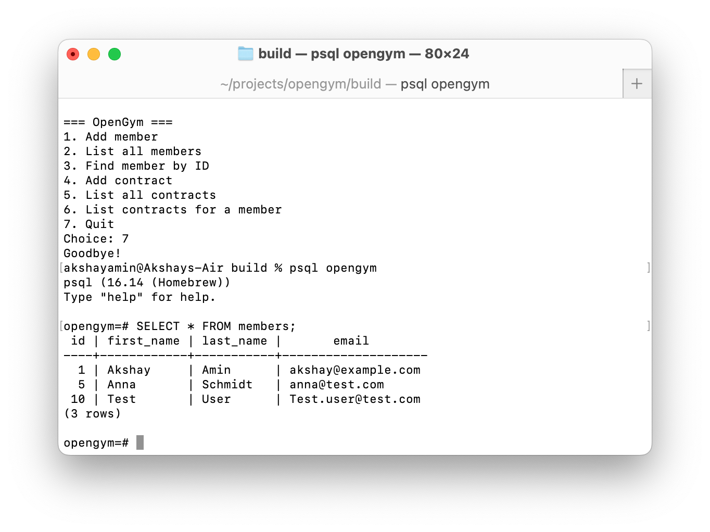

# OpenGym

A small C++ learning project — a gym management application with PostgreSQL persistence. Built to refresh my C++ fundamentals and understand how business objects, database persistence, and application logic work together in a gym-management workflow.

## About this project

I studied C, C++, and PostgreSQL during my Bachelor of Computer Applications. While job-searching for analyst and junior developer roles in Germany, I wanted to bring those skills back into active shape and apply them in a small but realistic project.

OpenGym is a CLI-based gym management system that models the basics of how fitness studio software handles members, contracts, and the relationships between them. The focus is on clear structure: separating business objects, persistence, and the menu interface so each part has a single job.

## Screenshots

### Main menu


### Adding a member


### Listing all members


### Adding a contract


### Contracts for a specific member (foreign-key query)


### Same data viewed directly in PostgreSQL



## Features

- Add, list, and search gym members
- Add and list contracts with a foreign-key link to members
- List all contracts belonging to a specific member
- Input validation that handles bad input without crashing
- PostgreSQL persistence — data is saved automatically and survives between runs
- Interactive CLI menu

## Tech stack

- **Language:** C++20
- **Build system:** CMake
- **Database:** PostgreSQL 16
- **DB client library:** libpqxx 8
- **Platform:** macOS (clang++); should build on Linux with minimal changes

## Project structure
The `Repository` classes hold all the database code. `main.cpp` only calls methods like `addMember(...)` and `listAll()` — it doesn't know SQL. This made it easy to replace file storage with PostgreSQL later, because only the repository code changed.

## How to build and run

### Prerequisites (macOS)

```bash
brew install cmake postgresql@16 libpqxx pkg-config
brew services start postgresql@16
```

### Create the database

```bash
createdb opengym
psql opengym < database/schema.sql
psql opengym < database/sample_data.sql   # optional: load example data
```

### Build

```bash
mkdir -p build
cd build
cmake ..
make
```

### Run

```bash
./opengym
```

## Honest note about scope and AI assistance

This is a small learning project, not production software. I used AI assistance for learning C++ patterns, debugging, and structuring the code. See [EXPLANATION.md](EXPLANATION.md) for a clear breakdown of what I built, what I understand, what I learned, and where AI helped.

## What's next

- Check-in feature (matching a typical gym module)
- Qt or QML GUI
- Additional entities (Courses, Invoices)
- Unit tests

## Author

[Akshay Amin](https://github.com/Akshayamin13) — Bachelor of Computer Applications, MBA in General Technology Management (Data Science focus). Based in Oldenburg, Germany. Actively job-searching for analyst and junior developer roles in the DACH region.
